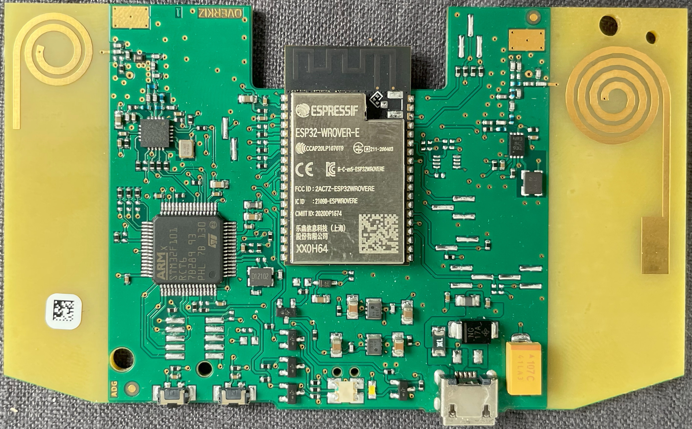
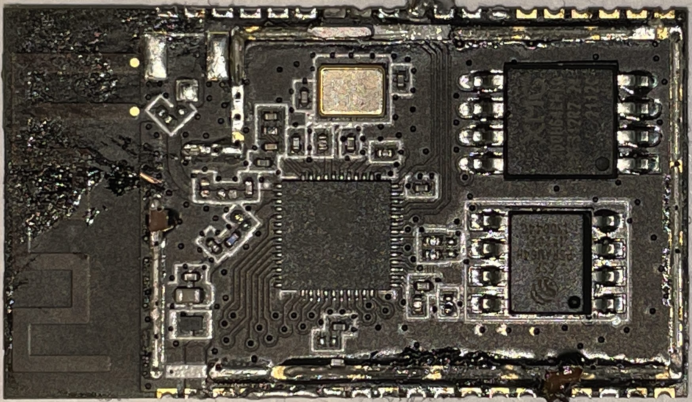
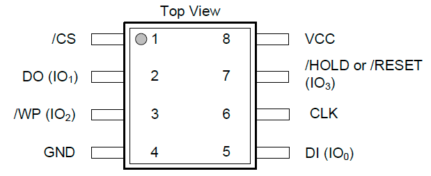
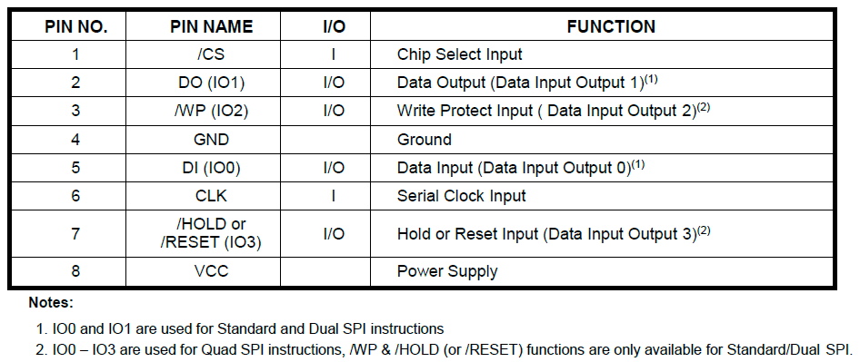

<div align="center" width="100%">

# Somfy Connectivity Kit

Analysis and Information about the Board Layout, PIN Definitions and ongoing efforts to "understand" the platform.

|  |
| :----------------------------------------------------------------------------: |
| Somfy Connectivity Kit PCB Top View                                            |

</div>

> [!CAUTION]
> When referencing PCB directions it is assumed that you are looking down at the PCB with the buttons facing towards you (like in the pictures).

## Hardware Overview

- Espressif [ESP32-WROVER-E (N8R8) v2.1 Module](#esp32-module)
  - MCU: Espressif ESP32-D0WD v3
  - ROM: [XMC XM25QH64CHIQ](#nor-flash-xm25qh64chiq) (8MB)
  - RAM: Espressif ESP-PSRAM64H (8MB)
- [STM32 F103 RCT6](#stm32f103) with 256kB ROM and 32kB RAM
- [Silicon Labs Si4461 Rev2A1](#si4461) radio is used for io-homecontrol
- [Semtech SX1243](#sx1243) radio chip is used for Somfy RTS (433MHz)

<div align="center" width="100%">

``` mermaid
%%{init:{"fontFamily":"monospace","flowchart":{"curve":"linear"}}}%%

flowchart LR
subgraph minikiz["Somfy Connectivity Kit Overview"]
  direction LR
  subgraph iohc["io-homecontrol"]
    direction TB
    stm32{"STM32<br>F101RC"}<--"UART"-->si4461{{"Si4461"}}
  end
  subgraph wrover["ESP32 WROVER-E (N8R8-2.1) Module"]
    direction TB
    esp32{"ESP32<br/>D0WD-V3"}
    ram[["8 MB<br/>RAM<br/>(PSRAM64H)"]]
    rom[["8 MB<br/>ROM<br/>(XM25QH64C)"]]
    esp32<--"SPI"-->ram
    esp32<--"SPI"-->rom
  end
  subgraph rts["RTS"]
    direction TB
    sx1243{{"SX 1243"}}
  end
  iohc<--"SPI"-->wrover--"TWI<br/>(I2C)"-->rts
end
```

</div>

### Apple HomeKit Support

This is the log that shows up when you connect the device to your network.

``` log title="somfy_connectivity_kit-homekit.log"
Service Somfy Connectivity kit._hap._tcp.local. added
type='_hap._tcp.local.'
name='Somfy Connectivity kit._hap._tcp.local.'
addresses=[b'\xc0\xa8\xbao'] # C0 A8 BA 6F
server='MyHost.local.' port=31988
properties={
  b'c#': b'3'
  b'ci': b'2'
  b'ff': b'2'
  b'id': b'C1:56:B3:DA:5D:96'
  b'md': b'Connectivity kit'
  b'pv': b'1.1'
  b's#': b'35'
  b'sf': b'0'
  b'sh': b'1Aynbg==' (0x000C006E)
```

### LED Colors

The LED(s) display the product's operating mode or status.

- Orange: Boot Phase
- Blue "Breathing": WiFi credential change
- White Flashing: WiFi/Server connection
- Red Flashing: Not connected to Wifi or Server
- White: Connected to Server

## ESP32 Module

Overkiz is using the official ESP bootloader and WebIOPi (Python) to test via serial.

<div align="center" width="100%">

| ESP32-WROVER-E module without shield                                                                                     |
| :----------------------------------------------------------------------------------------------------------------------: |
|                                 |
| [ESP32 Pinout Reference: Which GPIO pins should you use?](https://randomnerdtutorials.com/esp32-pinout-reference-gpios/) |

</div><details markdown><summary>ESP32 <> STM32 GPIO Interconnection Summary</summary><div align="center" width="100%">

| ESP32<br>GPIO | STM32<br>PIN | DBG<br>PIN        | FUNCTION                                                                                                            |
| :-----------: | :----------: | :---------------: | :-----------------------------------------------------------------------------------------------------------------  |
| **LEFT**      |              |                   | **ESP32 LEFT ROW: 1 - 19** (Top>Bottom)                                                                             |
| GND           |              |                   | 0                                                                                                                   |
| 3V3           |              |                   | 1                                                                                                                   |
| EN            |              |                   | ChipEnable / Reset                                                                                                  |
| VP            |              | Button:`Prog`     | Button: Right Side                                                                                                  |
| VN            |              | DBG:1             | Bridge Point 1                                                                                                      |
| 34            |              | DBG:2             | Bridge Point 2                                                                                                      |
| 35            |              | DBG:3             | Bridge Point 3                                                                                                      |
| 32            |              | LED               | LED:Green                                                                                                           |
| 33            |              | LED               | nc?                                                                                                                 |
| 25            |              | LED               | LED:White                                                                                                           |
| 26            |              | :grey_question:   | Debug Port with missing Chip (UART?)                                                                                |
| 27            |              | :grey_question:   | Debug Port with missing Chip (UART?)                                                                                |
| 14            | 42`TX`       | DBG:Rx            | `HSPI_CK`/ `JTAG TDMS` - TestArea3-Bottom                                                                           |
| 12            |              | LED               | `HSPI_Q` / `JTAG TDDI` - LED-BlueWiFi<br>*Strap*: LOW for Boot Mode: "*should be kept low when module is on.*"      |
| GND           |              |                   | 0                                                                                                                   |
| 13            |              | RTS               | `HSPI_DATA`  / `JTAG CK` - RTS:6CTRL                                                                                |
|               |              |                   |                                                                                                                     |
| **RIGHT**     | **STM32**    |                   | **ESP32 RIGHT ROW: 20 - 38** (Top>Bottom)                                                                           |
| GND           |              |                   | 0                                                                                                                   |
| 23            |              | Button/LED        | `VSPI DATA` - Button and LED                                                                                        |
| 22            |              | RTS               | `UART RTS / VSPI WP` - UpRight-Left<br>RTS:2DATA                                                                    |
| TXD           |              | UART:Tx           | `UART TX` - UpRight-Right<br>*Strap*: Debug Output                                                                  |
| RXD           |              | UART:Rx           | `UART RX` - UpRight-Middle<br>*Strap*: HIGH at Boot Mode                                                            |
| 21            |              | DBG:Unknown       | `VSPI HD` - Debug RightSide of ESP with 3 Contacts (Top)<br>Function Unknown. Used in with IO2 to select Boot Mode? |
| nc            |              |                   | nc                                                                                                                  |
| 19            |              | RTS               | `VSPI Q` / `UART CTS` - RTS:5RST                                                                                    |
| 18            | `BOOT0`      | STM32:BootMode    | `VSPI CLK`                                                                                                          |
| 5             |              | UNCORRECT:`Reset` | `VSPI CS` - *Strap*: 0 = BootMode                                                                                   |
| nc            |              |                   | nc                                                                                                                  |
| nc            |              |                   | nc                                                                                                                  |
| 4             | `RESET`      | Button:???/SWD    | `HSPI HD=HOLD` Button: Left Side / SWD:1RST                                                                         |
| 0             |              | Strap             | `CLK OUT` - Test2-Middle<br>*Strap*: 0 = BootMode                                                                   |
| 2             |              | Strap             | `HSPI WP=WriteProtect` - Test1-Middle<br>*Strap*: 0 = BootMode                                                      |
| 15            | 43`RX`       | DBG:Tx            | `HSPI CS` / `JTAG DO` - Test3-Top<br>*Strap*: 1 = Debug Log @ `UART TX`                                             |

> [ESP32 GPIO Summary](https://docs.espressif.com/projects/esp-idf/en/latest/esp32/api-reference/peripherals/gpio.html#gpio-summary) | [SPI Explanation](https://randomnerdtutorials.com/esp32-spi-communication-arduino/) | [Boot Mode Selection](https://docs.espressif.com/projects/esptool/en/latest/esp32/advanced-topics/boot-mode-selection.html)

</div></details>

There are two unknown "areas":

- *IO26*, *IO27*: Connected to an unpopulated area which seems to hold a chip during testing (could be seen from the marker at the bottom of the right side).
- *IO21*, *IO2*: Could be used for selection of the Boot Mode or load/start a special app since *IO2* is a *Strap Pin* and *IO21* could serve as a [Boot from Test Firmware](https://docs.espressif.com/projects/esp-idf/en/latest/esp32/api-guides/bootloader.html#boot-from-test-firmware) pin.

### ESP32 Boot Mode Selection and Jumper PINs

You can find two buttons at the bottom of the device which can be used to set a different operating mode. The ESP32 has it's own modes as does the STM32 have.
The modes of the STM32 get directly triggered by the ESP32 and can't be set from the outside. The ESP32 has additional lines to set the `BOOT0` and`BOOT1` PINs of the STM32.

The first table describes the PINs and the corresponding connection area on the Connectivity Kit PCB or the function for which it is (normally) used.
Remember that the ESP32 has a mux matrix to assign any PIN to any function (eg. UART, SPI, etc.).

<details markdown><summary>ESP32 Boot Mode and Jumper PINs</summary><div align="center" width="100%">

| PIN  | FUNCTION         |
| ---: | :--------------- |
| IO5  | Button 1 RST     |
| VP   | Button 2 PROG    |
| -->  | -->              |
| VN   | Jumper 1 Left    |
| IO34 | Jumper 2 Left    |
| IO35 | Jumper 3 Left    |
| IO23 | Jumper 4 Bottom  |
| IO0  | Jumper 5 Right   |
| -->  | -->              |
| TXD0 | UART Tx          |
| RXD0 | UART Rx          |
| IO26 | Debug 1          |
| IO27 | Debug 1          |
| IO21 | Debug 2          |
| IO2  | Debug 2          |
| IO14 | STM32 + JTAG TMS |
| IO15 | STM32 + JTAG     |
| IO18 | STM32 BOOT0      |
| IO4  | STM32 RESET      |

**ESP32 Boot Mode Selection:**

|  PIN |  STD  | BOOT  | Normal | Jumper |
| ---: | :---: | :---: | :----: | :----: |
| IO00 |   1   |   0   |   18   | YES    |
| IO02 |   0   |   0   |   14   |        |
| IO21 |   ?   |  13   |   14   |        |

> Jumper means the PIN is connected to the outside world and can be triggered. Either via debug interface or button.

</div></details>

### ESP32 Bootloader

Bootlogs from my somewhat broken board ...

<details markdown><summary>ESP32 Bootlogs</summary>

``` python title="esptool.py"
etc Mon dd yyyy hh:mm:ss
rst:0x0 (NO_MEAN),boot:0x0 (DOWNLOAD_BOOT(UART0/UART1/SDIO_FEI_FEO_V2))
ets_main.c 404

...

etc Mon dd yyyy hh:mm:ss
rst:0x1 (POWERON_RESET),boot:0x13 (SPI_FAST_FLASH_BOOT)
configsip: 0, SPIWP:0xee
clk_drv:0x00,q_drv:0x00,d_drv:0x00,cs0_drv:0x00,hd_drv:0x00,wp_drv:0x00
mode:DIO, clock div:2
load:0x3fff0018,len:4
load:0x3fff001c,len:7960
load:0x3d234c30,len:-1713843249
1150 mmu set 00010000, pos 00010000

...

etc Mon dd yyyy hh:mm:ss
rst:0x10 (RTCWDT_RTC_RESET),boot:0x13 (SPI_FAST_FLASH_BOOT)
flash read err, 988
ets_main.c 384

...

etc Mon dd yyyy hh:mm:ss
rst:0x10 (RTCWDT_RTC_RESET),boot:0x13 (SPI_FAST_FLASH_BOOT)
configsip: 0, SPIWP:0xee
clk_drv:0x00,q_drv:0x00,d_drv:0x00,cs0_drv:0x00,hd_drv:0x00,wp_drv:0x00
mode:DIO, clock div:2
load:0x3fff0018,len:4
load:0x3fff001c,len:7960
load:0x3d234c30,len:-1713843249
1150 mmu set 00010000, pos 00010000
```

</details>

### NOR Flash: XM25QH64CHIQ

The flash chip sitting on the ESP32 Wrover-E module has 8MB and is connected via SPI.

- XM25 = Company Prefix + SPI Flash Family
- QH = Series: 2.3~3.6V, 4KB uniform-sector, Quad Mode
- 64 = Density: 64 MBit
- CHI = Version: SOP 208mil 8L Package + Temp. Range: Industrial (-40 - +85°C)
- Q = QE Code

<details markdown><summary>Flash PIN Out and Connection Diagram</summary><div align="center" width="100%">

|  |
| :-------------------------------------------------------------------: |
| XM25QH64C Connection Diagram                                          |

> *`QPI` needs `QE` bit in Status Register-2 set. When `QE=1`, `/WP` => `IO2` and `/HOLD` => `IO3.*`

|  |
| :-----------------------------------------------------------: |
| XM25QH64C PIN Out                                             |

</div></details>

## STM32F103

The STM32 ioHC firmware knows different "modes". Since there are at least four unknown PINs that could be bridged my educated guess is these are used for boot mode selection ;>

It is assumed that the STM32 runs the same ioHC firmware as all other boxes from Somfy/Overkiz.
<!-- TODO More information about the firmware, chip and reverse engineering can be found here: -->

<details markdown><summary>STM32 PIN Out</summary><div align="center" width="100%">

| STM32      | Si4462      | ESP32              | DBG         | FUNCTION                                                   |
| :--------- | :---------: | :----------------: | :---------: | :--------------------------------------------------------- |
| **RIGHT**  |             |                    |             |                                                            |
| 5          |             |                    | TST         | Can be shorted with 6                                      |
| 6          |             |                    | TST         | Can be shorted with 5                                      |
| 7:`RST`    |             | IO4:`io_reset`     | SWD1:       | Reset                                                      |
|            |             |                    |             |                                                            |
| **TOP**    |             |                    |             |                                                            |
| 12:`?`     |             |                    | TBD         | Boot Mode Selection                                        |
| 13:`?`     |             |                    | TBD         | Boot Mode Selection                                        |
| 17:`?`     |             |                    | TBD         | Boot Mode Selection                                        |
| 19:`?`     |             |                    | TBD         | Boot Mode Selection                                        |
| 20:`NSS1`  | 15: `SEL`   |                    | SPI         | `SPI1 NSS` <> Si4461: `SEL`                                |
| 21:`CKL1`  | 12: `CLK`   |                    | SPI         | `SPI1 CLK` <> Si4461: `CLK`                                |
| 22:`MISO1` | 13: `SDO`   |                    | SPI         | `SPI1 MISO` <> Si4461: `SDO`                               |
| 23:`MOSI1` | 14: `SDI`   |                    | SPI         | `SPI1 MOSI` <> Si4461: `SDI`                               |
| 28:`BOOT1` |             |                    | `io_boot_1` | Boot Mode Selection<br/>**NOTE**: `10k Pull Down Resistor` |
| 29:`SCL`   | 20: `GPIO3` |                    |             | `GPIO3` <> USART3_TX / SCL                                 |
| 30:`SDA`   | 19: `GPIO2` |                    |             | `GPIO2` <> USART3_RX / SDA                                 |
| 31:`?`     |             |                    | TBD         |                                                            |
| 32:`?`     |             |                    | TBD         |                                                            |
|            |             |                    |             |                                                            |
| **LEFT**   |             |                    |             |                                                            |
| 33         |             |                    | MODE_SEL    | SPI2_NSS  / USART3_CK  / SMBA                              |
| 34         |             |                    | MODE_SEL    | SPI2_SCK  / USART3_CTS                                     |
| 35         |             |                    | MODE_SEL    | SPI2_MISO / USART3_RTS                                     |
| 38         |             |                    | MODE_SEL    |                                                            |
| 41:`?`     |             |                    | TBD         |                                                            |
| 42:`TXD1`  |             | IO14:`io_usart_tx` | USART       | USART1_TX                                                  |
| 43:`RXD1`  |             | IO15:`io_usart_rx` | USART       | USART1_RX                                                  |
| 46         |             |                    | SWD5:       | JTMS-SWDIO (PA13)                                          |
| 48:`?`     |             |                    | TBD         |                                                            |
|            |             |                    |             |                                                            |
| **BOTTOM** |             |                    |             |                                                            |
| 49         |             |                    | SWD4:CLK    | JTCK-SWCLK (PA14)                                          |
| 50         |             |                    | SWD2:DI     | JTDI / SPI3_NSS (PA15)                                     |
| 55         |             |                    | SWD3:DO     | JTDO (PB3)                                                 |
| 56         |             |                    | SWD6:RST    | NJTRST (PB4)                                               |
| 60:`BOOT0` |             | IO18:`io_boot_0`   | BOOT_SEL    | Boot Mode Selection                                        |
| 62         |             |                    | MODE_SEL    | Switch: Left                                               |

</div></details>

### STM32 Debug Header

<div align="center" width="100%">

``` mermaid
%%{init:{"fontFamily":"monospace","flowchart":{"curve":"linear"}}}%%
stateDiagram
  direction LR

  classDef stm32Pin fill:grey
  classDef headerPin fill:white
  class RESET,JTDI,JTDO_TRACESWO,JTCK_SWCLK,JTMS_SWDIO,JTRST,NOT_CONNECTED,GND1,GND2,VDD headerPin
  class PIN07_RST,PIN50_PA15,PIN55_PB3,PIN49_PA14,PIN46_PA13,PIN56_PB4,GROUND,PIN64,STM32 stm32Pin

  state "Somfy Connectivity Kit: Serial Wire JTAG Debug Port (SWJ-DP)" as Debug_Header
  state Debug_Header {

  state "Left Row" as leftrow
  state leftrow {
    direction LR
    state "7:RST" as PIN07_RST
    PIN07_RST --> RESET
    state "50:A15" as PIN50_PA15
    PIN50_PA15 --> JTDI
    state "55:B3" as PIN55_PB3
    state "&nbsp;&nbsp;JTDO<br/>TRACESWO" as JTDO_TRACESWO
    PIN55_PB3 --> JTDO_TRACESWO
    state "49:A14" as PIN49_PA14
    state "&nbsp;JTCK<br/>SWCLK" as JTCK_SWCLK
    PIN49_PA14 --> JTCK_SWCLK
    state "46:A13" as PIN46_PA13
    state "&nbsp;JTMS<br/>SWDIO" as JTMS_SWDIO
    PIN46_PA13 --> JTMS_SWDIO
  }

  state "STM32 Pin:<br/>#:Function" as STM32

  state "Right Row" as rightrow
  state rightrow {
    direction LR
    state "56:B4" as PIN56_PB4
    PIN56_PB4 --> JTRST
    state "&nbsp;&nbsp;&nbsp;Not<br/>Connected" as NC
    state "&nbsp;&nbsp;&nbsp;Not<br/>Connected" as NOT_CONNECTED
    NC --> NOT_CONNECTED
    state "GND" as GND1
    GROUND --> GND1
    state "GND" as GND2
    GROUND --> GND2
    state "64:VDD" as PIN64
    PIN64 --> VDD
  }
}
```

| PIN Name AT91 = STM32   | Serial RF | Test | Update | Flash | Stack |
| :---------------------- | :-------: | :--: | :----: | :---: | :---: |
| PA3/PE10/PC09 = TEST_RF | 1         | 0    |        |       | 1     |
| PA5/PE11/PC11 = BOOT0   | 0         | 0    | 0      | 1     | 0     |
| PA6/PE12/PC17 = BOOT1   | 0         | 0    | 1      | 0     | 0     |

> PIN names for STM32s with ioHC firmware extracted from AT91 DTBs (TaHoma/Cozytouch/etc.)

</div>

## Si4461

Interface: SPI. GPIO are configured by the GPIO_PIN_CFG command 13h. A complete list of the GPIO options could be found in the API guide.
<!-- TODO: link to si re page -->

<div align="center" width="100%">

| Si4461    | STM32     | DBG  | FUNCTION                                                         |
| --------: | :-------: | :--: | :--------------------------------------------------------------: |
| 9:`IO0`   | TODO      | TBD  | See `GPIO_PIN_CFG`<br/>**NOTE**: Could be shorted with 11:`nIRQ` |
| 11:`nIRQ` | See 9:IO0 | TBD  | See `GPIO_PIN_CFG`<br/>**NOTE**: Could be shorted with 9:`IO0`   |
| 12:`SCL`  | 21        | SPI  | `CLK`  <> Si4461_`CLK`                                           |
| 13:`SDO`  | 22        | SPI  | `MISO` <> Si4461_`SDO`                                           |
| 14:`SDI`  | 23        | SPI  | `MOSI` <> Si4461_`SDI`                                           |
| 15:`SEL`  | 20        | SPI  | `NSS`  <> Si4461_`nSEL`                                          |
| 16:`XOUT` |           | XTAL | 26 MHz                                                           |
| 17:`XIN`  |           | XTAL | 26 MHz                                                           |
| 19:`IO2`  | 30        |      | See `GPIO_PIN_CFG`                                               |
| 20:`IO3`  | 29        |      | See `GPIO_PIN_CFG`                                               |
| 1: `SDN`  | 17        | PWR  | Shutdown                                                         |

</div>

## SX1243

The Semtech SX1243 is used for Somfy RTS and connected via TWI (I2C) to the ESP32.

<div align="center" width="100%">

| SX1243      | ESP32          | DBG<br>PIN | FUNCTION    |
| :---------: | :------------: | :--------: | :---------: |
| 6: `CTRL`   | IO13:`HSPI D`  | I2C        | Data        |
| 2: `DATA`   | IO22:`VSPI WP` | I2C        | Chip Select |
| 5: `nRESET` | IO19:`VSPI Q`  | RESET      | Reset       |

</div>

On bigger boards the `sel` Pin is used to set the freq as shown in this example:

``` shell
sel = pioB 14 0 = frequency = 433920000 # Not Always connected
sel = pioB 14 1 = frequency = 433420000 # Not Always connected
```
